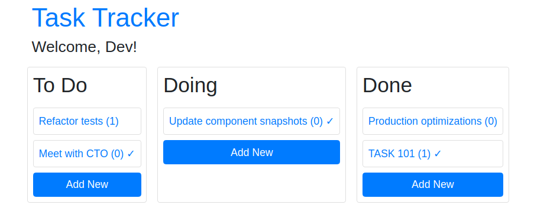
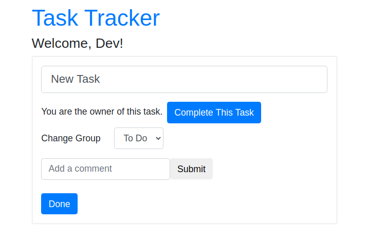

# TASK-TRACKER
An simple web application to track/add/update tasks.
__Teach Stack__: React JS, Node JS, Mongo DB, REST.

# FEW SCREEN SHOTS

## Login
  

## Signup
  

## Dashboard
  

## Add new task
  
